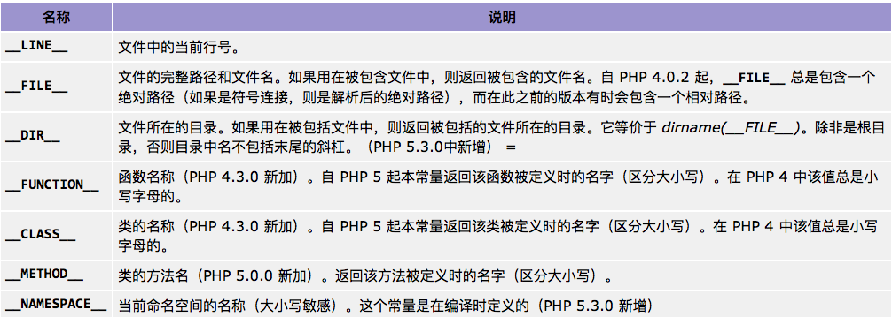

php中变量名都是跟在美元符号$后面,变量名由字母或者下划线开头，后面跟上任意数量的字母，数字，或者下划线。

```php
php > $name = "Tom";
php > $NAME = "Jack";
php > echo $name;
Tom
php > echo $NAME; //变量名区分大小写
Jack
```


#### 1. 变量的赋值
 
  * **直接赋值**

当一个变量的值赋予另外一个变量时，改变其中一个变量的值，将不会影响到另外一个变量

```php
php > $a = 10;
php > $b = $a;
php > $a = 5;
php > echo 'a的值为:'.$a."\n".'b的值为'.$b;
a的值为:5
b的值为10
```

  * **引用赋值**

改动新的变量将影响到原始变量，改变原始变量也会影响到新的变量，使用引用赋值需在变量名面前加&符号。

```php
php > $a = 10;
php > $b = $a;
php > $c = &$a;
php > $a = 5;
php > echo "a的值为$a\n"."b的值为$b\n"."c的值为$c";
a的值为5
b的值为10
c的值为5
```

#### 2. 变量的操作

  * **是否声明**

bool isset ( mixed $var )

如果$var存在即返回true，不存在返回false。

```php
php > var_dump(isset($sex));
bool(false)
php > $sex = "man";
php > var_dump(isset($sex));
bool(true)
```
 
  * **是否为空**

bool empty ( mixed $var )

如果$var是非空或者非零，返回false；" "、0、"0"、NULL、FALSE、array()，以及没有任何属性的对象都将被认为是空的，如果 var 为空，则返回 TRUE。
 
```php
bool(true)
php > $name = "Tom";
php > var_dump(empty($name));
bool(false)
```

  * **释放变量**

void unset ( mixed $var [, mixed $var [, $... ]] )

销毁指定变量$var。

```php
php > $name = "tom";
php > var_dump(isset($name));
bool(true)
php > unset($name);
php > var_dump(isset($name));
bool(false)
```

#### 3. 全局变量

  * **global 关键字**

```php
<?php
$a = 1;
$b = 2;
function Sum()
{
    global $a, $b;
    $b = $a + $b;
}
Sum();
echo $b;

输出结果:3
```

  * **$GLOBALS 数组**
  
```php
<?php
$a = 1;
$b = 2;
function Sum()
{
    $GLOBALS['b'] = $GLOBALS['a'] + $GLOBALS['b'];
}
Sum();
echo $b;

输出结果:3
```

#### 4. 静态变量

static $var

静态变量仅在局部函数域中存在，但当程序执行离开此作用域时，其值不丢失。
    
```php
<?php
function test()
{
    static $count = 0;
    $count++;
    echo $count;
    if ($count < 10) {
        test();
    }
    $count--;
}
test();

输出结果:12345678910
```


### 常量

常量是简单值的标识符，对大小写敏感，标识符总是大写的。

**定义常量:** define ( '标识符' , '对应值' )
 
```php
php > define("NAME",'tom');
php > echo NAME;
tom
```

**常见"魔术"常量**


