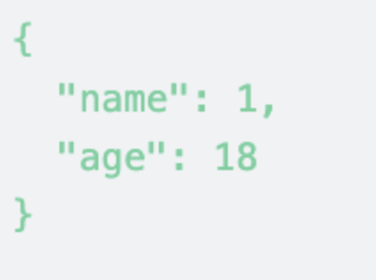

```js
let a = { name: 1, age: 18 }
let c = JSON.stringify(a, null, 2); // '{\n  "name": 1,\n  "age": 18\n}'

// DOM
<h1 class="p-4 text-green-400"><pre>{
  "name": 1,
  "age": 18
}</pre></h1>
```

最终格式化输出样式



# 参考资料
[React Higher Order Components in depth](https://medium.com/@franleplant/react-higher-order-components-in-depth-cf9032ee6c3e)

[JSON.stringify() - JavaScript | MDN](https://developer.mozilla.org/zh-CN/docs/Web/JavaScript/Reference/Global_Objects/JSON/stringify)

[- HTML（超文本标记语言） | MDN](https://developer.mozilla.org/zh-CN/docs/Web/HTML/Element/pre)