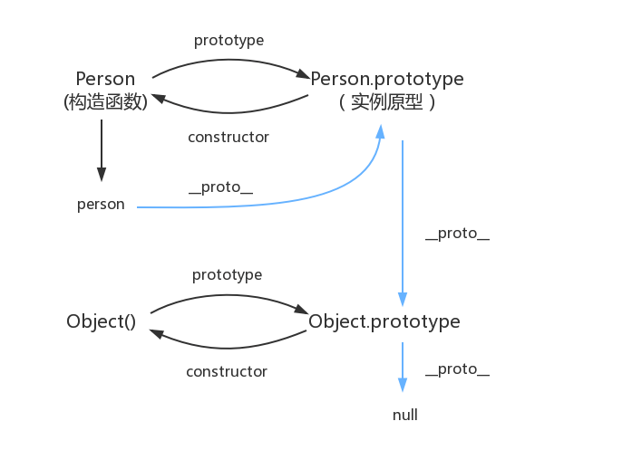

# Javascript 原型链

- Created: November 30, 2021 10:10 PM
- Update: March 14, 2022 9:50 PM
- 分类: JavaScript
- 可参考文章: 
    * https://github.com/mqyqingfeng/Blog/issues/2
    * https://www.toptal.com/javascript/es6-class-chaos-keeps-js-developer-up
    * https://developer.mozilla.org/zh-CN/docs/Web/JavaScript/Inheritance_and_the_prototype_chain
- 学习状态: Yes
- 学习进度: 已复习
- 模块: 前端基础

# 原型链是什么？



当读取实例属性的时候，如果找不到，就会查找与实例相关联的原型上的属性，如果还找不到，就去找原型的原型上的，直到找到最顶层为止

注意⚠️

- 所有的对象都有 `__*proto*__`
- `prototype` 只有函数有
- 不是所有的函数都有 `prototype`, 由 `bind` 返回的函数没有 prototype 属性

# 可能有那些副作用？

- 代码不是很容理解，排查对象属性可能忽略其原型上属性

# 面试可能问?

- How Do You Implement Privacy in Classes?（如何实现一个私有类）
    
    * 即访问类属性，必须通过暴露出的方法，比如 getName，才能访问私有属性
    
    ```jsx
    function SecretiveProto() {
        const secret = "The Class is a lie!"
        this.spillTheBeans = function() {
          console.log(secret)
        }
      }
      
      const blabbermouth = new SecretiveProto()
      try {
        console.log(blabbermouth.secret)
      }
      catch(e) {
        // TypeError: SecretiveClass.secret is not defined
      }
      
      blabbermouth.spillTheBeans() // "The Class is a lie!"
    ```
    
- class VS prototype
    
    * class 是 ES6 新提出的语法，更像 const, let 更好的限制和控制范围，它可以看作是 prototype 的语法糖，babel 编译后会转成 prototype 实现方式
    
    - class 必须由 new 开始调用
    - class 可以扩展比构造函数更多的类型
    - class 的原型仅仅是它的父类，继承静态属性
    - 非类不能扩展类，因为他们不能调用父构造函数
    
    [What is the difference between prototype-based class syntax and class syntax in JavaScript?](https://stackoverflow.com/questions/49643582/what-is-the-difference-between-prototype-based-class-syntax-and-class-syntax-in)
    
- **[说一下对原型链的理解，画一个经典的原型链图示](https://github.com/lgwebdream/FE-Interview/issues/279)**
    
    * 当读取实例属性时，优先查找当前实例，如果没有，则继续向与实例相关联的原型上查找，如果没有，就去原型的原型上找，直到最顶层
    

# 参考资料

[As a JS Developer, This Is What Keeps Me Up at Night](https://www.toptal.com/javascript/es6-class-chaos-keeps-js-developer-up)

[node-escpos/index.js at v3 · song940/node-escpos](https://github.com/song940/node-escpos/blob/v3/packages/network/index.js)