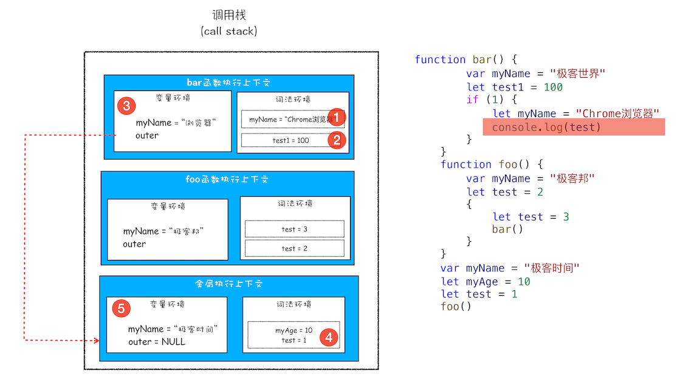

# 作用域

- Created: November 30, 2021 10:09 PM
- Update: March 14, 2022 10:39 PM
- 分类: JavaScript
- 可参考文章: 
    - https://github.com/mqyqingfeng/Blog/issues/6
    - https://ui.dev/ultimate-guide-to-execution-contexts-hoisting-scopes-and-closures-in-javascript/?spm=ata.13261165.0.0.2d8e16798YR8lw
- 学习状态: Yes
- 学习进度: 已复习
- 模块: 前端基础

```jsx
function bar() {
    console.log(myName)
}
function foo() {
    var myName = " 极客邦 "
    bar()
}
var myName = " 极客时间 "
foo()

// 由声明位置决定 => 极客时间
```


# 问题1:什么是作用域？

**作用域是指在程序中定义变量的区域，该位置决定了变量的生命周期。通俗地理解，作用域就是变量与函数的可访问范围，即作用域控制着变量和函数的可见性和生命周期**

es6 支持块级作用域 let, const

当代码中包含块级作用域变量时，会存放到该函数的词法环境中，例如下图



# 问题2: 什么是作用域链？

查找变量的时候，优先从当前上下文的变量对象中查找，没有则向父级执行上下文中查找，直到全局变量对象（window）。这种多个执行上下文，形成的调用链表，就是作用域链

# 问题3: bar是在foo中调用，为什么执行上下文指向的全局？

因为作用域链是由词法作用域决定的，而词法作用域就是：根据函数的声明位置来决定词法作用域，例如下图：


# 面试可能问?

- 下面两段代码返回结果是什么？有什么不同?
    - 答案
        
        因为函数作用域，由函数位置决定
        
        local scope
        
        local scope
        
    
    ```jsx
    // 代码1
    var scope = "global scope";
    function checkscope(){
        var scope = "local scope";
        function f(){
            return scope;
        }
        return f();
    }
    checkscope();
    
    //  代码2
    var scope = "global scope";
    function checkscope(){
        var scope = "local scope";
        function f(){
            return scope;
        }
        return f;
    }
    checkscope()();
    ```
    
- 下面代码输出什么?
    - 答案
        
        函数作用域由函数声明位置决定，而不是调用位置
        
        1
        
    
    ```jsx
    function bar() {
        var myName = " 极客世界 "
        // let test1 = 100
        if (1) {
            let myName = "Chrome 浏览器 "
            console.log(test)
        }
    }
    function foo() {
        var myName = " 极客邦 "
        let test = 2
        {
            let test = 3
            bar()
        }
    }
    var myName = " 极客时间 "
    let myAge = 10
    let test = 1
    foo()
    ```
    
- var 缺陷以及为什么要引入let和const?
    - 之前的只有全局作用域和函数作用域，在编译过程中，变量提升会带来一些问题
        - 变量可能在不知情情况被覆盖掉（变量覆盖）
        - 本应销毁的变量未销毁（变量污染）
    
    [块级作用域：var缺陷以及为什么要引入let和const | 浏览器工作原理与实践](https://blog.poetries.top/browser-working-principle/guide/part2/lesson09.html#%E4%BD%9C%E7%94%A8%E5%9F%9F%EF%BC%88scope%EF%BC%89)
    
- JavaScript是如何支持块级作用域的?
    
    通过词法环境的栈结构实现
    
    