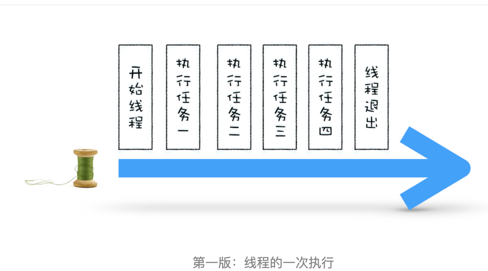
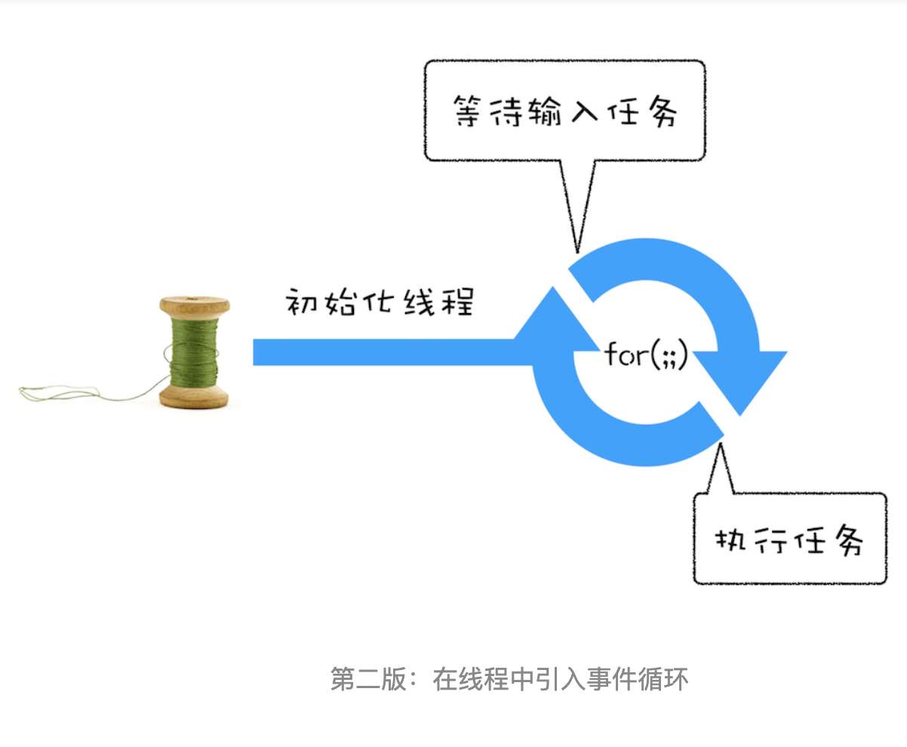
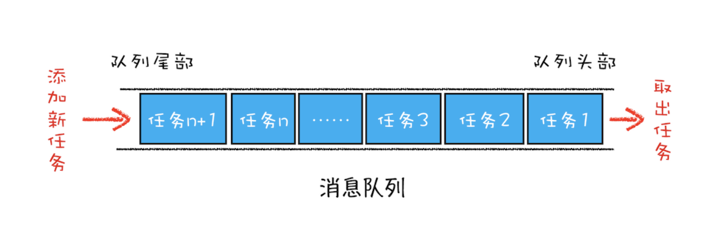
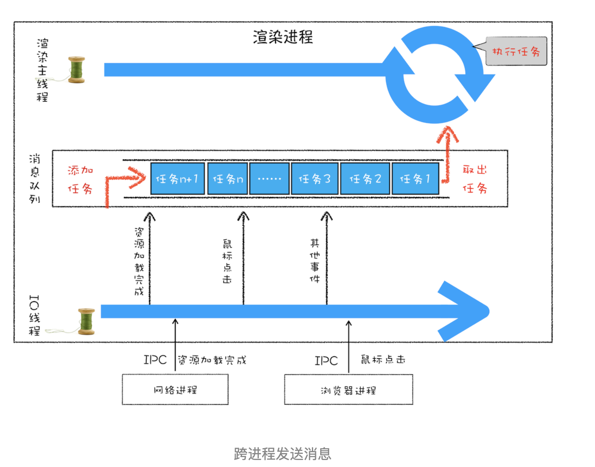

# 事件循环机制

- Created: November 30, 2021 10:13 PM
- Update: March 15, 2022 12:19 AM
- 分类: JavaScript
- 可参考文章: https://zhuanlan.zhihu.com/p/33058983, https://blog.poetries.top/browser-working-principle/guide/part4/lesson15.html#%E5%AE%9E%E8%B7%B5%EF%BC%9A%E6%B5%8F%E8%A7%88%E5%99%A8%E9%A1%B5%E9%9D%A2%E6%98%AF%E5%A6%82%E4%BD%95%E8%BF%90%E8%A1%8C%E7%9A%84
- 学习状态: Yes
- 学习进度: 已复习
- 模块: 前端基础

浏览器的事件循环系统是什么？

为什么需要事件循环机制？

一次普通的线程，按照计划好的任务顺序，依次执行，然后退出

但是

通常在我们实际场景中，肯定在线程运行过程中，会有新的任务产生，并且需要线程接收并执行，这时候就需要事件循环系统

进而

如果要接收其他线程的任务并处理，就需要消息队列

最后，线程模型就是队列+循环的方式

所以，总结就是三步

- 添加一个消息队列
- 接收一个任务添加到消息队列尾部
- 线程循环从消息队列取出任务并执行

但是，在浏览器中基于该线程模型，页面是单线程的，任务是依次执行，就有需要前一个任务执行完成，才能执行下一个任务的属性，也就有了下面两个问题：

1. 如何处理高优先级任务？
    
    比较典型的例子是 DOM 监听变化(节点插入，更新，删除等)，采用监听的方式，这时候就需要去权衡通知的实时性和效率
    
    所以，就有了微任务
    
    消息队列的任务为宏任务，每个宏任务中都包含了一个微任务队列，执行宏任务过程中，可能会添加微任务到微任务队列中去，等宏任务主要功能完成后，开始检查微任务队列，依次取出执行，直到微任务队列完成，再开始下一个宏任务执行
    
2. 如何解决单个任务执行时间过长问题？
    
    事件回调，不影响主任务执行
    

消息队列中任务有哪些类型？

- 内部消息类型
    - 输入事件（例如鼠标滚动、键盘输入、点击、移动）
    - WebSocket
    - JavaScript 定时器 setTimeout、setInterval
    - 文件读写
    - 微任务
    - ...
- 页面相关事件
    - JavaScript 执行
    - DOM 解析
    - 样式计算
    - 布局计算
    - CSS 动画
    - ...
    

# 在哪些地方遇到过？

vue.nextTick