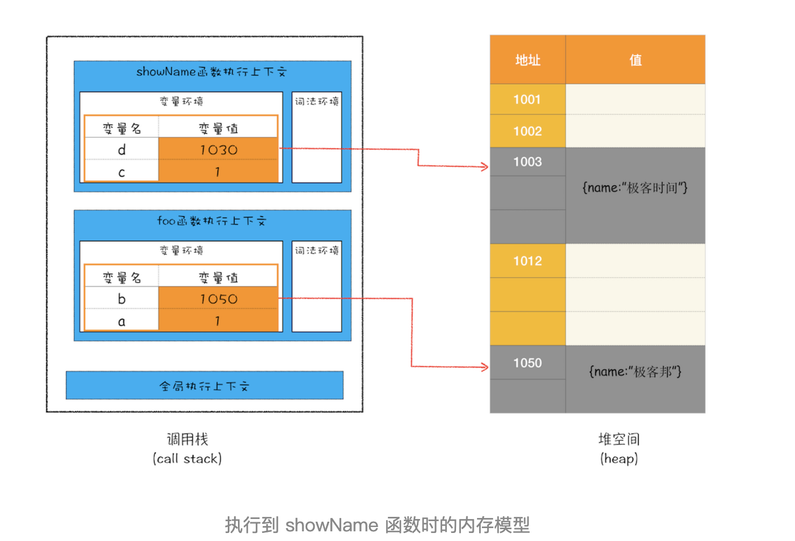
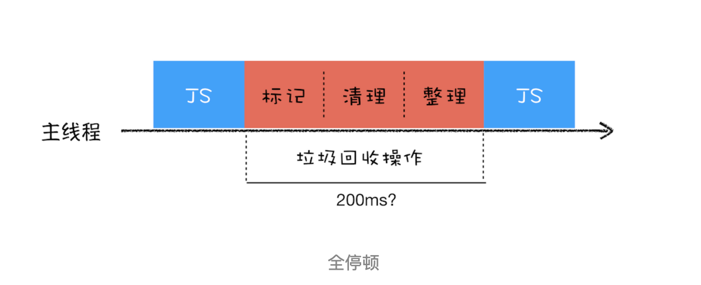

# v8垃圾回收机制

- Created: November 30, 2021 10:12 PM
- Update: March 15, 2022 12:07 AM
- 分类: JavaScript
- 学习状态: Yes
- 学习进度: 已复习
- 模块: 前端基础

# V8 的工作原理



v8垃圾回收主要采取分代式垃圾回收机制

根据对象存活的时间分为新生代和老生代，分别采用不同的垃圾回收策略

垃圾回收时，会暂停主进程任务执行，回收完成后，再开始下一个任务。所以v8垃圾回收需要考虑尽量不影响主进程执行任务，比如页面渲染，动画执行等等

### 新生代

采用的是 scavenge 算法，将内存空间一分为二，一块为激活空间 form, 主要存新生代对象，另一块为未激活空间 to，主要用于垃圾回收后，存活对象的拷贝迁移

先将新生代的对象存入到 from 空间，采用标记检测对象是否在使用，如果没有被使用则清除，剩余存活的新生代则被复制到 to 空间，然后交换 to 空间 和 from 空间的身份

新生代因为频繁的垃圾回收处理，在保证效率和性能的情况下，所以保存的对象一般都很小

当经历几次垃圾回收后仍存活的对象，会晋升为老生代，即对象晋升。

### 对象晋升

晋升条件


### 老生代

采用 标记清除(mark-sweep) 和 标记整理(mark-compact) 算法，遍历对象检查是否在被使用，如果有则标记，然后清除所有未标记对象。

标记清除后，会产生内存空间不连续问题，所以为了解决这个问题，又引入了标记整理策略，即将存活的对象往内存空间的一端移动，移动完成后清除掉其他空间

老生代保存的对象一般都很大，所以垃圾回收相较于新生代不会太频繁

### 全停顿

因为垃圾回收会占用主进程，暂停正在执行的javascript脚本，等垃圾回收完成后，再恢复执行，这样的情况就是全停顿(stop-the-world)



而老生代一般对象都比较大，处理起来更加消耗资源和占用主进程，所以后续又提出了 增量标记、延迟清理、增量整理 等策略，在浏览器空闲的时候处理垃圾回收，尽量减少占用主进程时间，减少垃圾回收对主进程影响，提升应用性能

### 如何避免内存泄露

- 少声明全局变量
    
    因为会挂载到 window，而 window 对象时垃圾回收标记检测时，无法准确检查引用的
    
- 少使用闭包
    
    同样闭包函数当执行完成后，调用栈会弹出其上下文执行，但是闭包函数使用的变量，会一直存在内存中，不会被清理
    
- 在合适的时机关闭定时器
    
    setTimeout、setInterval
    
- 必要时，使用弱引用
    
    es6新提出的 WeakMap、WeakSet
    

# 面试可能问

- 浏览器怎么进行垃圾回收？
- 浏览器中不同类型变量的内存都是何时释放？
- 执行test后,说一说，堆栈发生了啥变化，最后c的内存会被回收吗？
    
    ```jsx
    function test() {  
      var a = 1;  
      var b = {};  
      var c = {a: a};  
      return c;
    }
    ```
    
    [执行test后,说一说，堆栈发生了啥变化，最后c的内存会被回收吗？ · Issue #157 · sisterAn/JavaScript-Algorithms](https://github.com/sisterAn/JavaScript-Algorithms/issues/157)
    
- 哪些情况会导致内存泄露？如何避免？
- weakMap weakSet 和 Map Set 有什么区别？
    
    - [介绍下 Set、Map、WeakSet 和 WeakMap 的区别？ - 掘金](https://juejin.cn/post/6844904047351169038)