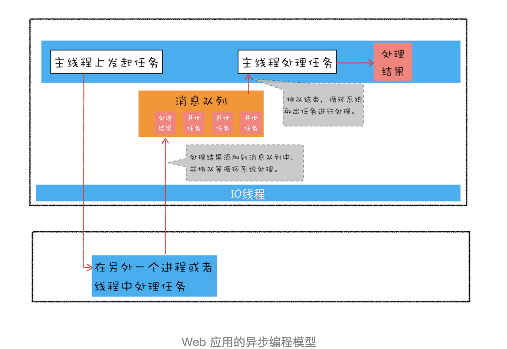

# promise原理

- Created: November 30, 2021 10:13 PM
- Update: March 15, 2022 12:42 AM
- 分类: JavaScript
- 可参考文章: 
    - https://juejin.cn/post/6844904063570542599
    - https://mengera88.github.io/2017/05/15/promise%E5%AD%A6%E4%B9%A0%E7%AC%94%E8%AE%B0/
    - https://mengera88.github.io/2017/05/18/Promise%E5%8E%9F%E7%90%86%E8%A7%A3%E6%9E%90/
    - https://blog.poetries.top/browser-working-principle/guide/part4/lesson19.html#promise%EF%BC%9A%E6%B6%88%E7%81%AD%E5%B5%8C%E5%A5%97%E8%B0%83%E7%94%A8%E5%92%8C%E5%A4%9A%E6%AC%A1%E9%94%99%E8%AF%AF%E5%A4%84%E7%90%86
- 学习状态: Yes
- 学习进度: 已复习
- 模块: 前端基础



# 引入动机及解决的问题

Web页面是单线程架构模型，这种模型决定了我们编写代码的形式——异步编程。基于异步编程模型写出来的代码会把一些关键逻辑点打乱，所以这种风格可读性比较差，不符合人的线性思维方式。在复杂的场景下，会有回调地狱的问题：

- 多层嵌套问题
- 每种任务的处理结果有成功或者失败，就需要在每种任务执行结束后分别处理两种情况

Promise 通过回调函数延迟绑定，回调函数返回值穿透和错误“冒泡”解决了上面2个问题。

Primise 使用微任务是因为 Promise 回调函数延迟绑定技术导致的

- Promise解决了什么问题?
    
    异步编码风格问题
    
- Promise是如何解决嵌套回调问题?
    - 回调函数的延迟绑定
    - 回调函数返回值穿透
- Promise原理
    
    promise 相当于状态机，有三种状态(保证执行顺序)
    
    - pending 初始化执行
    - fulfilled 执行成功完成
    - rejected 执行失败
    
    ```jsx
    // 对象初始化状态为 pending
    const p = new Promise((resolve, reject) => {
    	// TODO
      if 
      resolve();
    	// 调用 resolve 后，状态由 pending => fulfilled，触发 then 函数
      
      else
    	// TODO
      reject();
      // 调用 reject 后，状态由 pending => rejected，触发 catch 函数
    });
    
    // 一旦状态转化为 fulfilled, rejected，则不可再变更
    ```
    
    promise then 方法，保证可以链式调用
    
    ```jsx
    // 链式调用
    p.then((res) => { 
    	console.log('then res:', res) 
    }).then((res_2) => {
    	console.log('then res_2:', res2)
    })
    
    // 等同于
    
    // p1 是一个新的 Promise 对象
    // 即 回调函数返回值(新 promise 对象)穿透到最外层，赋值给 p1
    const p1 = p.then((res) => { 
    	console.log('then res:', res) 
      return 'p';
    })
    
    p1.then((res_2) => {
    	console.log('then res_2:', res2)
      return 'p2'
    })
    ```
    
- Promise是如何处理异常的?
    
    promise 错误具有“冒泡”特性，会一直向后传递，直到被 onReject 或 catch 捕获
    
    所以需要思考“冒泡”特性是什么？是如何去实现的？
    

# 面试可能问:

- **[手写代码]实现 Promise.all 方法**
    
    ```jsx
    /**
     * 手写实现 Promise.all 方法
     * 接受参数： interable 可迭代对象, Array, Map, Set, String
     * 执行处理：遍历执行可迭代对象中的每一个元素，并将结果放入一个数组中
     * 返回值： Promise 对象，携带执行结果数组，如果有一个执行失败，则返回失败的结果
     */
    Promise.all = function(args) {
        return new Promise(function(resolve, reject) {
            if (args.length === 0) {
                return resolve([]);
            }
    
            var result = [];
            var count = 0;
            var len = args.length;
    
            function res(i, val) {
                try {
                    if (val && (typeof val === 'object' || typeof val === 'function')) {
                        var then = val.then;
                        if (typeof then === 'function') {
                            // Promise(resolve(), reject())
                            then.call(val, function(re) {
                                res(i, re);
                            }, reject);
                            return;
                        }
                    }
                    result[i] = val;
                    count++;
                    // if (++count === len) {
                    if (count === len) {
                        return resolve(result);
                    }
                } catch(err) {
                    return reject(err)
                }
            }
    
            for (var i = 0; i < len; i++) {
                res(i, args[i]);
            }
        });
    }
    
    const test1 = Promise.all([new Promise((resolve, reject) => {
        setTimeout(() => {
            resolve('1')
        }, 1000)
    }), new Promise((resolve, reject) => {
        setTimeout(() => {
            resolve('2')
        }, 2000)
    }), new Promise((resolve, reject) => {
        setTimeout(() => {
            resolve('3')
        }, 3000)
    })]);
    test1.then(function(res) {
        console.log('test1 res', res)
    }).catch((error) => {
        console.log('test1 error', error)
    })
    ```
    
- **Promise.all 中任何一个 Promise 出现错误的时候都会执行 reject，导致其它正常返回的数据也无法使用。你有什么解决办法么？**
    - 使用 Promise.allSettled
- **[Day153:Promise.resolve(obj)，obj 有几种可能](https://github.com/lgwebdream/FE-Interview/issues/967)**
    
    [Promise - JavaScript | MDN](https://developer.mozilla.org/zh-CN/docs/Web/JavaScript/Reference/Global_Objects/Promise)
    
    - thenable，返回的promise最终状态由then方法执行决定
    - 空 或者 常量 或者 不带then方法的对象，都直接传递给then
- **Promise.allSettled 了解吗？动手实现一下 Promise.allSettled**
    
    - 当所有的promise都执行完成，无论成功或者失败，返回一个promise，并带有一个对象数组，即执行结果组成的一个数组
    
    ```jsx
    Promise.allSettled = function(args) {
        return new Promise(function(resolve, reject) {
            var result = [];
            var count = 0;
            var len = args.length;
    
            function res(i, val, isFulfilled = true) {
                try {
                    if (val && (typeof val === 'object' || typeof val === 'function')) {
                        var then = val.then;
                        if (typeof then === 'function') {
                            then.call(val, function(rs) {
                                res(i, rs, true);
                            }, function(err) {
                                res(i, err, false);
                            });
                            return;
                        }
                    }
                    if (isFulfilled) {
                        result[i] = { status: 'fulfilled', value: val };
                    } else {
                        result[i] = { status: 'rejected', reason: val };
                    }
                    count++;
                    if (count === len) {
                        return resolve(result);
                    }
                } catch (error) {
                    result[i] = { status: 'rejected', reason: error };
                    count++;
                    if (count === len) {
                        return resolve(result);
                    }
                }
            }
    
            for (var i = 0; i < len; i++) {
                res(i, args[i]);
            }
        });
    }
    
    const test1 = Promise.allSettled([new Promise((resolve, reject) => {
        setTimeout(() => {
            resolve('1')
        }, 1000)
    }), new Promise((resolve, reject) => {
        setTimeout(() => {
            reject('2');
        }, 2000)
    }), new Promise((resolve, reject) => {
        setTimeout(() => {
            resolve('3')
        }, 3000)
    })]);
    test1.then(function(res) {
        console.log('test1 res:', ...res)
    }).catch((error) => {
        console.log('test1 error:', error)
    })
    ```
    
- [Day329:说一说 promise，有几个状态，通过 catch 捕获到 reject 之后，在 catch 后面还能继续执行 then 方法嘛，如果能执行执行的是第几个回调函数?](https://github.com/lgwebdream/FE-Interview/issues/1157)
    
    - promise 有三个状态，分别为 pending, fulfilled, rejected，且这几个状态转化如下:
    
    pending ⇒ fulfilled
    
    pending ⇒ rejected
    
    fulfilled 和 rejected 不能相互转
    
    catch捕获到reject之后，catch可以顺序执行then方法，但是只执行then的第一个回调，即resolve 回调
    
    ```jsx
    Promise.reject("hello").catch(() => {
    	console.log('catch 1');
    }).then(() => {
    	console.log('then resolve 1')
    }, () => {
    	console.log('then reject 1')
    }).catch(() => {
    	console.log('catch 2')
    }).then(() => {
    	console.log('then resolve 2')
    }, () => {
    	console.log('then reject 2')
    })
    
    // 输出结果
    catch 1
    then resolve 1
    then resolve 2
    ```
    
- **[Day218:说下下面两段代码执行情况](https://blog.poetries.top/browser-working-principle/guide/part4/lesson18.html#%E5%AE%8F%E4%BB%BB%E5%8A%A1)**
    
    - 这个问题考察 浏览器底层原理，微任务和宏任务
    
    promise是微任务，如果在执行微任务的过程中，产生了新的微任务，同样会将该微任务添加到队列中，v8引擎会循环执行微任务队列中的任务，直到队列为空才算执行结束，也就是说在执行微任务过程中产生的新微任务不会推迟到下个宏任务中执行，而是在当前的宏任务中继续执行。
    
     settimeout是宏任务，回调函数会推入延迟队列，在调用 settimeout 设置回调任务的间隙，可能插入很多系统级的宏任务，比如页面渲染。
    
    ```jsx
    // 代码片段一：是否存在堆栈溢出错误?
    function foo() {
      setTimeout(foo, 0);
    }
    foo();
    
    // 代码片段二:如果在控制台中运行以下函数，页面(选项卡)的 UI 是否仍然响应?
    function foo() {
      return Promise.resolve().then(foo);
    }
    
    // 答
    // 第一个 foo 不会
    // 第二个 foo 会
    ```
    
- **[Day167:修改代码不造成死循环](https://github.com/lgwebdream/FE-Interview/issues/981)**
    
    ```jsx
    while(1){
      console.log(Math.random());
    }
    ```
    
    这道题考察点是什么呢？
    
    js是单线程，不存在真正意义的并行，但是存在并发；
    
    因此，如果上面循环想要正确执行，而不死循环，不堵塞的话，肯定是异步或者多线程
    
    ```jsx
    /*
    * 使用异步模拟多线程
    */
    (async function() {
    	while(await Promise.resolve()) {
    		console.log(Math.random());
    	}
    })
    
    /*
    * 使用 web worker，不堵塞主线程
    */
    const worker = new Worker("worker.js");
    worker.onmessage = function(val) {
    	// 接收worker 传过来的数据
      console.log(val);
    }
    
    // worker.js
    while(1) {
    	const n = Math.random();
      if (n > 0.9) {
    		postMessage(n);
        break;
    	}
    }
    ```
    
- **[Day127:按要求完成 mergePromise 代码](https://github.com/lgwebdream/FE-Interview/issues/940)**
- **[Day121:说一下 在 map 中和 for 中调用异步函数的区别](https://github.com/lgwebdream/FE-Interview/issues/934)**
    - map 是在同步执行完成后，立即进入下一次循环，即所有的异步几乎会同时发起请求
    - for 会等待异步执行结果，再进入下一次循环，即依次发起异步请求
    
    [Day121:说一下 在 map 中和 for 中调用异步函数的区别 · Issue #934 · lgwebdream/FE-Interview](https://github.com/lgwebdream/FE-Interview/issues/934#issuecomment-677414828)
    
- **[介绍下 promise 的特性、优缺点](https://github.com/lgwebdream/FE-Interview/issues/880)**
    
    ### Promise 基本特性
    
    - promise 有三种状态：pending（进行中）、fulfilled（已成功）、rejected（已失败）
    - promise对象接收一个回调函数作为参数，该回调函数接受两个参数，分别是成功回调 resolve，失败回调 reject；resolve的参数可以是原始类型, 还可以是一个 promise 对象，reject的参数通常是一个 error 对象
    - then 方法返回一个新的 promise 实例，并接收两个参数 onResolved(fulfilled状态的回调)， onRejected(rejected状态的回调，该参数可选)
    - catch 方法返回一个新的实例
    - finally 方法不管 promise 状态如何都会执行，回调函数不接受任何参数
    - promise.all() 方法将多个 promise 实例，包装成一个新的 promise 实例，如果其中有 promise 执行失败，则 promise.all 异步地将它的失败结果，传递给 rejected 状态回调函数
    - promise.race() 方法的参数与 promise.all 一样，传入的 promise 中，只要有一个完成，则将其结果传递给 promise.race 的 fulfilled 状态回调函数
    - promise.resolve() 将现有对象转为 promise 对象
        - 如果该方法参数是一个 promise 对象，则不做处理
        - 如果是 thenable对象（即有 then 方法），则将该对象转为 promise 对象，并立即执行 then 方法
        - 如果是一个原始类型(String, Number, BigInt, Null, Undefined, Boolean, Symbol)，或是一个不具有 then 方法的对象，则返回一个新的 promise 对象，状态为 fulfilled，该参数会作为then方法中，onResolved回调函数的参数
        - 如果不带参数，直接返回一个 fulfilled 状态的 promise 对象
    - promise.reject()
        - 返回一个 promise 对象，状态为  rejected，无论传入任何参数都将作为 reject的参数
        
    
    ### Promise 优点
    
    - 统一异步 API
        - 即异步编码规范
    - 链式调用
    
    ### Promise 缺点
    
    - 无法取消, 一旦创建就会立即执行
    - 错误捕获，只能在内部预判，调用回调函数返回，即无法在外部通过 try catch，只能内部 try catch，再 reject 抛出
    - 处于 pending 状态时，无法得知目前进展到哪一个阶段（刚刚开始还是即将完成）
    - promise 真正执行回调的时候，定义 promise 那部分已经执行完成，所以 promise 的报错堆栈上下文不太友好
- 动手实现 promise（内部是如何实现的）