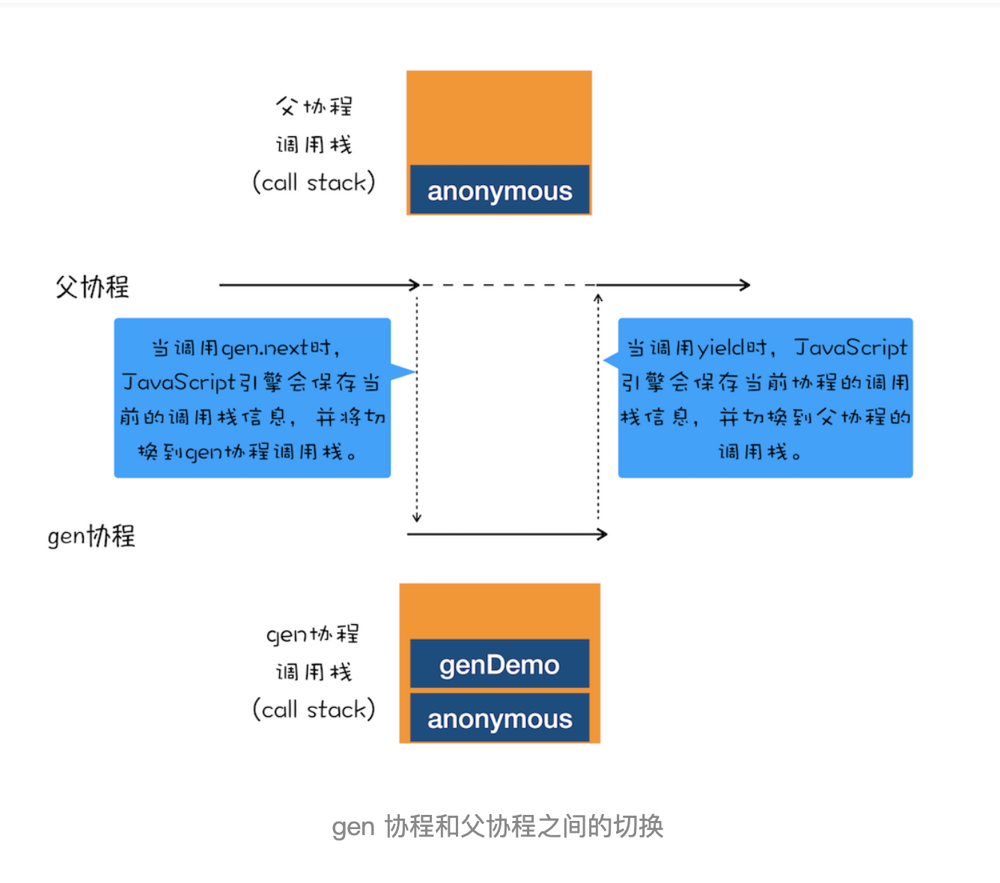
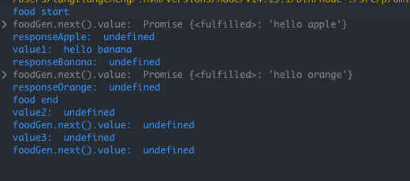
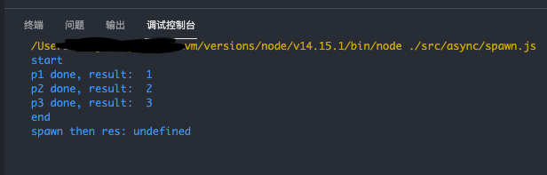

# async/await 原理

- Created: December 2, 2021 12:00 AM
- Update: March 15, 2022 1:30 AM
- 分类: JavaScript
- 可参考文章: 
    - https://blog.poetries.top/browser-working-principle/guide/part4/lesson20.html#async-await
    - https://developer.mozilla.org/zh-CN/docs/Learn/JavaScript/Asynchronous/Async_await
- 学习状态: Yes
- 学习进度: 已复习
- 模块: 前端基础

在不阻塞主线程情况下，使用同步代码方式执行异步操作，代码逻辑更清晰

- async 和 await 是如何工作的？
    
    基础技术是：生成器 generator 和 Promise，生成器底层是协程，可以实现生成器函数的暂停和恢复
    
    一个进程可以有多个线程，一个线程可以有多个协程，但是协程执行是单一的，比如 a，b，a，c，  a就是父协程，b，c是子协程
    
    - async 是一个异步执行并隐式返回 Promise 的函数
    - await 会暂停代码执行，直到 promise 完成，返回结果值
    
    
    
- ~~使用 Generator 和 Promise 模拟实现 await async~~
    
    ```jsx
    function getFood(foodName) {
        return new Promise((resove, reject) => {
            resove('hello ' + foodName);
        })
    }
    
    function *food() {
        console.log('food start');
        let responseApple = yield getFood('apple');
        console.log('responseApple: ', responseApple);
    
        let responseBanana = yield getFood('banana');
        console.log('responseBanana: ', responseBanana);
    
        let responseOrange = yield getFood('orange');
        console.log('responseOrange: ', responseOrange);
    
        console.log('food end');
    }
    
    let foodGen = food();
    
    function getFoodGenPromise(foodGen) {
        console.log('foodGen.next().value: ', foodGen.next().value);
        // 返回一个promise
        return foodGen.next().value
    }
    
    // 开始执行，返回一个promise，并继续执行它的 then 方法
    getFoodGenPromise(foodGen)
    .then(function(value1) { // 当前 promise 执行完毕，返回一个新的 promise
        console.log('value1: ', value1);
        return getFoodGenPromise(foodGen);
    }).then(function(value2) { // 当前 promise 执行完毕，返回一个新的 promise
        console.log('value2: ', value2);
        return getFoodGenPromise(foodGen);
    }).then(function(value3) { // 当前 promise 执行完毕，结束
        console.log('value3: ', value3);
    });
    ```
    
    执行结果如图:
    
    
    

# 面试可能问:

- **[对 async、await 的理解，内部原理是怎样的？](https://github.com/lgwebdream/FE-Interview/issues/499)**
    
    ### 一、理解
    
    async 是 Generator 函数的语法糖，并对 Generator 函数进行了改进
    
    - async: 声明一个异步函数，自动将普通函数转换为 promise，返回一个 promise 对象，只有 async 函数内部的异步执行完成，才会执行 then 方法回调函数，内部可以使用 await 暂停异步函数执行
    - await: 暂停函数执行，并返回其执行结果
    
    1. 更好的语义化
        
        async 和 await，比起星号和 yield，语义更加清楚易懂
        
    2. 更广的适用性
        
        yield 命令后面只能是 thunk 函数或者 promise 对象，而 async 的 await 后面 可以是 promise 或者 原始类型，他们会自动转换成 promise 对象
        
    3. 返回值是promise
        
        可以直接使用 then 方法指定下一步处理
        
    
    ### 二、原理
    
    async 函数的实现原理是将 generator 函数 和 自动执行器包装在一个函数里，与 generator 相比，多了下面几个特性：
    
    - 内置执行器，不需要手动 next()
    - await 后面可以是 promise，可以是 普通 function，适用更广
    
    ```jsx
    async function fn(args) {
    	// TODO
    }
    
    // 等同于
    
    function fn(args) {
    	return spawn(function* () {
    		// TODO
    	})
    }
    ```
    
    ```jsx
    // 自动执行器
    function spawn(genFn) {
        return new Promise((resolve, reject) => {
            const gen = genFn(); // 先将 generator 函数执行下，拿到遍历器对象
    
            function step(nextFn) {
                let next;
                try {
                    next = nextFn(); // 尝试获取下一个值
                } catch (e) {
                    return reject(e);
                }
                if (next.done) { // 判断是否已结束
                    return resolve(next.value);
                }
    
    						// 如果没结束，则继续调用，传入返回值
                Promise.resolve(next.value).then((res) => {
                    step(() => {
                        return gen.next(res);
                    })
                }, (error) => {
                    step(() => {
                        return gen.throw(error);
                    })
                })
            }
    
            step(() => {
                return gen.next();
            });
        })
    }
    
    const p1 = function () {
    	return new Promise((resolve, reject) => {
    		setTimeout(() => {
    			resolve("1");
    		}, 1000);
    	});
    };
    
    const p2 = function () {
    	return new Promise((resolve, reject) => {
    		setTimeout(() => {
    			resolve("2");
    		}, 2000);
    	});
    };
    
    const p3 = function () {
    	return new Promise((resolve, reject) => {
    		setTimeout(() => {
    			resolve("3");
    		}, 3000);
    	});
    };
    
    function* gen() {
        console.log('start');
        const result1 = yield p1();
        console.log('p1 done, result: ', result1);
        const result2 = yield p2();
        console.log('p2 done, result: ', result2);
        const result3 = yield p3();
        console.log('p3 done, result: ', result3);
    
        console.log('end');
    }
    
    spawn(gen).then((res) => {
        console.log('spawn then res:', res);
    });
    ```
    
    输出如下图
    
    
    
- **[Async 里面有多个 await 请求，可以怎么优化](https://github.com/lgwebdream/FE-Interview/issues/460)**
    
    让 await 请求并行
    
    ```jsx
    const p1 = function () {
    	return new Promise((resolve, reject) => {
    		setTimeout(() => {
    			resolve("1");
    		}, 1000);
    	});
    };
    
    const p2 = function () {
    	return new Promise((resolve, reject) => {
    		setTimeout(() => {
    			resolve("2");
    		}, 2000);
    	});
    };
    
    const p3 = function () {
    	return new Promise((resolve, reject) => {
    		setTimeout(() => {
    			resolve("3");
    		}, 3000);
    	});
    };
    
    /**
     * 共计 3s
     * 因为 p1, p2, p3 三个异步操作都是并行执行的，所以共计 3s
     * 根据实际场景，选择 Promise.all 或 Promise.allSettled
     */
    async function parallelDemo1() {
    	console.log("start:", Date.now());
    	Promise.all([p1(), p2(), p3()]).then((res) => {
    		console.log("parallelDemo1 执行结果:", ...res);
        	console.log("end:", Date.now());
    	});
    }
    
    /**
     * 共计 3s
     * 因为 p1, p2, p3 三个异步操作都是并行执行的，所以共计 3s
     */
    async function parallelDemo2() {
    	const r1 = p1();
    	const r2 = p2();
    	const r3 = p3();
    
    	console.log("start:", Date.now());
    	const result1 = await r1;
    	console.log("result1:", result1);
    	const result2 = await r2;
    	console.log("result2:", result2);
    	const result3 = await r3;
    	console.log("result3:", result3);
    
    	console.log("end:", Date.now());
    
    	console.log("parallelDemo2 执行结果:", result1, result2, result3);
    }
    
    /**
     * 共计 6s
     * 因为 p1, p2, p3 三个异步操作都是串行执行的，所以共计 6s
     */
    async function unParallelDemo() {
    	console.log("start:", Date.now());
    	const result1 = await p1();
    	console.log("result1:", result1);
    	const result2 = await p2();
    	console.log("result2:", result2);
    	const result3 = await p3();
    	console.log("result3:", result3);
    
    	console.log("end:", Date.now());
    
    	console.log("parallelDemo2 执行结果:", result1, result2, result3);
    }
    
    parallelDemo1();
    
    // parallelDemo2();
    
    // unParallelDemo();
    ```
    
- **[promise 跟 async await 的区别，使用场景](https://github.com/lgwebdream/FE-Interview/issues/407)**
    
    ### 一、区别
    
    定义
    
    - Promise 是对象，用于表示一个异步操作的最终结果
    - async函数是使用`async`关键字声明的函数。 async函数是`[AsyncFunction](https://developer.mozilla.org/zh-CN/docs/Web/JavaScript/Reference/Global_Objects/AsyncFunction)`构造函数的实例，它会隐式的返回一个 promise 对象
    - await 是表达式，用于暂停当前异步函数执行，等待其结果并返回，只能在  async 里面使用
    
    错误捕获
    
    - 使用 async/await 语法，能在异步代码中也按照类似同步代码中一样的方式使用 try-catch 语句
    - Promise 的错误无法在外部被捕捉到，只能在内部预判处理
    
    中断
    
    - Promise 是一个状态机，本身无法完全终止
    - async function 可以使用 await 中断程序执行
    
    ### 二、关系
    
    async/await 主要想简化使用多个 promise 时的同步行为，并对一组 Promise 执行某些操作。Promise 结合 generator，自动执行器，可以实现 async/await 的效果。
    
    ### 三、使用场景
    
    - aysnc/await 主要为避免繁杂的 promise 链式调用，更加语义化
    - 具体场景具体分析，比如要并行执行一组 promise，可以使用 promise.all 等工具方法
    
- **[简单封装一个异步 fecth，使用 async await 的方式来使用](https://github.com/lgwebdream/FE-Interview/issues/155)**
- **[async、await 如何进行错误捕获](https://github.com/lgwebdream/FE-Interview/issues/406)**
    - try catch 捕获
    - 包装 async 返回的 promise, 使用 promise.then, promise.catch 处理
    
    ```jsx
    const [err, data] = await to(asyncFn());
    ```