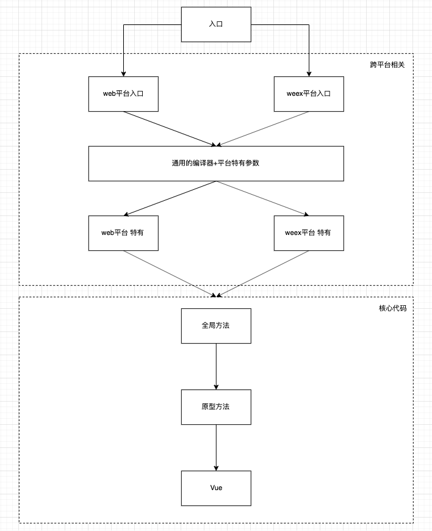

# vue基础概念

- Created: February 13, 2022 6:56 PM
- Update: March 20, 2022 10:28 PM
- 分类: Vue
- 可参考文章: 
    - https://www.ituring.com.cn/book/tupubarticle/29443?bookID=2675&type=tubook&subject=%E5%BA%8F%E4%B8%80
- 学习状态: Yes
- 学习进度: 复习中
- 模块: 开发框架

# 渐进式框架

什么是渐进式？即框架分层式


# 目录结构


# 构建版本


- UMD：可以直接在 script 引入使用
- CommonJS: 适用于低版本的打包工具，比如 webpack@1、Browserify
- ES Module: 适用于现代打包工具，比如 webpack@2、Rollup

# 项目架构



# Vue 实例方法

## vm.$on

### 用法

监听当前实例上的自定义事件，事件可以由vm.$emit触发。回调函数会接收所有传入事件所触发的函数的额外参数

```jsx
vm.$on(event, callback)

event: { String | Array<String> }
callback: Function
```

### 原理

实现原理：注册是将事件都收集起来，保存在 vm._events 中，供后续 vm.$emit 调用

- 实现源码
    
    ```jsx
    // 实现源码 src/core/instance/events.js
    
    Vue.prototype.$on = function (event: string | Array<string>, fn: Function): Component {
        const vm: Component = this
    
        // 如果传入 event 是集合，则遍历依次注册
        if (Array.isArray(event)) {
          for (let i = 0, l = event.length; i < l; i++) {
            this.$on(event[i], fn)
          }
        } else {
          // 将所有注册 event 都收集起来，保存在全局 vm._events 中，供后续 vm.$emit 调用
          (vm._events[event] || (vm._events[event] = [])).push(fn)
          // optimize hook:event cost by using a boolean flag marked at registration
          // instead of a hash lookup
          if (hookRE.test(event)) {
            vm._hasHookEvent = true
          }
        }
        return vm
      }
    ```
    

## vm.$once

和 on 类似，只是在第一次触发后，就自动销毁监听

- 实现源码
    
    ```jsx
    Vue.prototype.$once = function (event: string, fn: Function): Component {
        const vm: Component = this
        function on () {
          vm.$off(event, on)
          fn.apply(vm, arguments)
        }
        on.fn = fn
        vm.$on(event, on)
        return vm
      }
    ```
    

## vm.$off

### 用法

```jsx
vm.$off([event, callback])
```

vm.$off的作用是移除自定义事件，有几种情况需要处理

- 没有传值时，移除所有
- 仅传 event 时，移除指定
- 传 event, callback 时，仅移除该 event 的回调监听器

### 原理

- 实现源码
    
    ```jsx
    // 源码位置 src/core/instance/events.js
    
    Vue.prototype.$off = function (event?: string | Array<string>, fn?: Function): Component {
        const vm: Component = this
        // all
        if (!arguments.length) {
          vm._events = Object.create(null)
          return vm
        }
        // array of events
        if (Array.isArray(event)) {
          for (let i = 0, l = event.length; i < l; i++) {
            this.$off(event[i], fn)
          }
          return vm
        }
        // specific event
        const cbs = vm._events[event]
        if (!cbs) {
          return vm
        }
        if (arguments.length === 1) {
          vm._events[event] = null
          return vm
        }
        if (fn) {
          // specific handler
          let cb
          let i = cbs.length
          while (i--) {
            cb = cbs[i]
            if (cb === fn || cb.fn === fn) {
              cbs.splice(i, 1)
              break
            }
          }
        }
        return vm
      }
    ```
    

## vm.$emit

### 用法

```jsx
vm.$emit(event, [...args])
```

触发当前实例上的事件。附加参数都会传给监听器回调。vm.$emit的作用是触发事件。前面我们介绍过，所有的事件监听器回调函数都会存储在vm._events中，所以触发事件的实现思路是使用事件名从vm._events中取出对应的事件监听器回调函数列表，然后依次执行列表中的监听器回调并将参数传递给监听器回调

### 原理

- 实现源码
    
    ```jsx
    Vue.prototype.$emit = function (event: string): Component {
        const vm: Component = this
        if (process.env.NODE_ENV !== 'production') {
          const lowerCaseEvent = event.toLowerCase()
          if (lowerCaseEvent !== event && vm._events[lowerCaseEvent]) {
            tip(
              `Event "${lowerCaseEvent}" is emitted in component ` +
              `${formatComponentName(vm)} but the handler is registered for "${event}". ` +
              `Note that HTML attributes are case-insensitive and you cannot use ` +
              `v-on to listen to camelCase events when using in-DOM templates. ` +
              `You should probably use "${hyphenate(event)}" instead of "${event}".`
            )
          }
        }
        let cbs = vm._events[event]
        if (cbs) {
          cbs = cbs.length > 1 ? toArray(cbs) : cbs
          const args = toArray(arguments, 1)
          for (let i = 0, l = cbs.length; i < l; i++) {
            try {
              cbs[i].apply(vm, args)
            } catch (e) {
              handleError(e, vm, `event handler for "${event}"`)
            }
          }
        }
        return vm
      }
    ```
    

# 声明周期相关的实例方法

- vm.$forceUpdate
- vm.$destroy
- vm.$nextTick
- vm.$mount

## vm.$forceUpdate

强制当前实例的 watcher 执行 update 方法，因为之前说过 vue@2 watcher 颗粒度是到组件级别，所以 vm._watcher 即组件，执行update 即重新加载组件，强制刷新

- 源码实现
    
    ```jsx
    // 源码位置 src/core/instance/lifecycle.js
    
    Vue.prototype.$forceUpdate = function () {
        const vm: Component = this
        if (vm._watcher) {
          vm._watcher.update()
        }
      }
    ```
    

## vm.$destroy

vm.$destroy的作用是完全销毁一个实例，它会清理该实例与其他实例的连接，并解绑其全部指令及监听器，同时会触发beforeDestroy和destroyed的钩子函数

特别注意，它会先执行勾子函数 beforeDestroy，然后再销毁，最后会执行勾子函数 destroy

- 源码实现
    
    ```jsx
    // 源码实现 src/core/instance/lifecycle.js
    
    Vue.prototype.$destroy = function () {
        const vm: Component = this
        if (vm._isBeingDestroyed) {
          return
        }
        callHook(vm, 'beforeDestroy')
        vm._isBeingDestroyed = true
        // remove self from parent
        const parent = vm.$parent
        if (parent && !parent._isBeingDestroyed && !vm.$options.abstract) {
          remove(parent.$children, vm)
        }
        // teardown watchers
        if (vm._watcher) {
          vm._watcher.teardown()
        }
        let i = vm._watchers.length
        while (i--) {
          vm._watchers[i].teardown()
        }
        // remove reference from data ob
        // frozen object may not have observer.
        if (vm._data.__ob__) {
          vm._data.__ob__.vmCount--
        }
        // call the last hook...
        vm._isDestroyed = true
        // invoke destroy hooks on current rendered tree
        vm.__patch__(vm._vnode, null)
        // fire destroyed hook
        callHook(vm, 'destroyed')
        // turn off all instance listeners.
        vm.$off()
        // remove __vue__ reference
        if (vm.$el) {
          vm.$el.__vue__ = null
        }
        // release circular reference (#6759)
        if (vm.$vnode) {
          vm.$vnode.parent = null
        }
      }
    ```
    

## vm.$nextTick

接收一个回调函数，将该函数延迟到下次DOM更新循环之后执行。在修改数据之后立即使用它，然后等待 DOM 更新。它跟全局方法 `Vue.nextTick` 一样，不同的是回调的 `this` 自动绑定到调用它的实例上。

理解关键点：什么是下次DOM更新循环之后

在Vue.js中，当状态发生变化时，watcher会得到通知，然后触发虚拟DOM的渲染流程。而watcher触发渲染这个操作并不是同步的，而是异步的。Vue.js中有一个队列，每当需要渲染时，会将watcher推送到这个队列中，在下一次事件循环中再让watcher触发渲染的流程

而什么是事件循环呢？

这个和浏览器渲染核心原理有关

[消息队列和事件循环：页面是怎么活起来的 | 浏览器工作原理与实践](https://blog.poetries.top/browser-working-principle/guide/part4/lesson15.html#%E4%BD%BF%E7%94%A8%E5%8D%95%E7%BA%BF%E7%A8%8B%E5%A4%84%E7%90%86%E5%AE%89%E6%8E%92%E5%A5%BD%E7%9A%84%E4%BB%BB%E5%8A%A1)

所以核心就是

将更新DOM回调推入到微任务队列中

再将 nextTick 回调函数推入到微任务队列中

这时候在一个宏任务完成后，不会立即去执行下一个宏任务，而是先检查其微任务队列，依次执行，清空队列。

这时，因为 nextTick 的微任务是后面推入的，也就能拿到最新的DOM了。

### 实现流程


- 源码实现
    
    ```jsx
    // 源码位置 src/core/util/next-tick.js
    const callbacks = []
    let pending = false
    
    function flushCallbacks () {
      pending = false
      const copies = callbacks.slice(0)
      callbacks.length = 0
      for (let i = 0; i < copies.length; i++) {
        copies[i]()
      }
    }
    
    // Here we have async deferring wrappers using both micro and macro tasks.
    // In < 2.4 we used micro tasks everywhere, but there are some scenarios where
    // micro tasks have too high a priority and fires in between supposedly
    // sequential events (e.g. #4521, #6690) or even between bubbling of the same
    // event (#6566). However, using macro tasks everywhere also has subtle problems
    // when state is changed right before repaint (e.g. #6813, out-in transitions).
    // Here we use micro task by default, but expose a way to force macro task when
    // needed (e.g. in event handlers attached by v-on).
    let microTimerFunc
    let macroTimerFunc
    let useMacroTask = false
    
    // Determine (macro) Task defer implementation.
    // Technically setImmediate should be the ideal choice, but it's only available
    // in IE. The only polyfill that consistently queues the callback after all DOM
    // events triggered in the same loop is by using MessageChannel.
    /* istanbul ignore if */
    if (typeof setImmediate !== 'undefined' && isNative(setImmediate)) {
      macroTimerFunc = () => {
        setImmediate(flushCallbacks)
      }
    } else if (typeof MessageChannel !== 'undefined' && (
      isNative(MessageChannel) ||
      // PhantomJS
      MessageChannel.toString() === '[object MessageChannelConstructor]'
    )) {
      const channel = new MessageChannel()
      const port = channel.port2
      channel.port1.onmessage = flushCallbacks
      macroTimerFunc = () => {
        port.postMessage(1)
      }
    } else {
      /* istanbul ignore next */
      macroTimerFunc = () => {
        setTimeout(flushCallbacks, 0)
      }
    }
    
    // Determine MicroTask defer implementation.
    /* istanbul ignore next, $flow-disable-line */
    if (typeof Promise !== 'undefined' && isNative(Promise)) {
      const p = Promise.resolve()
      microTimerFunc = () => {
        p.then(flushCallbacks)
        // in problematic UIWebViews, Promise.then doesn't completely break, but
        // it can get stuck in a weird state where callbacks are pushed into the
        // microtask queue but the queue isn't being flushed, until the browser
        // needs to do some other work, e.g. handle a timer. Therefore we can
        // "force" the microtask queue to be flushed by adding an empty timer.
        if (isIOS) setTimeout(noop)
      }
    } else {
      // fallback to macro
      microTimerFunc = macroTimerFunc
    }
    
    /**
     * Wrap a function so that if any code inside triggers state change,
     * the changes are queued using a Task instead of a MicroTask.
     */
    export function withMacroTask (fn: Function): Function {
      return fn._withTask || (fn._withTask = function () {
        useMacroTask = true
        const res = fn.apply(null, arguments)
        useMacroTask = false
        return res
      })
    }
    
    export function nextTick (cb?: Function, ctx?: Object) {
      let _resolve
      callbacks.push(() => {
        if (cb) {
          try {
            cb.call(ctx)
          } catch (e) {
            handleError(e, ctx, 'nextTick')
          }
        } else if (_resolve) {
          _resolve(ctx)
        }
      })
      if (!pending) {
        pending = true
        if (useMacroTask) {
          macroTimerFunc()
        } else {
          microTimerFunc()
        }
      }
      // $flow-disable-line
      if (!cb && typeof Promise !== 'undefined') {
        return new Promise(resolve => {
          _resolve = resolve
        })
      }
    }
    ```
    

## vm.$mount

如果 Vue 实例在实例化时没有收到 el 选项，则它处于“未挂载”状态，没有关联的 DOM 元素。可以使用 `vm.$mount()` 手动地挂载一个未挂载的实例。

即，挂载 el 到 Vue 实例上

```jsx
var MyComponent = Vue.extend({
  template: '<div>Hello!</div>'
})

// 创建并挂载到 #app (会替换 #app)
new MyComponent().$mount('#app')

// 同上
new MyComponent({ el: '#app' })

// 或者，在文档之外渲染并且随后挂载
var component = new MyComponent().$mount()
document.getElementById('app').appendChild(component.$el)
```

- 实现源码
    
    ```jsx
    Vue.prototype.$mount = function (
      el?: string | Element,
      hydrating?: boolean
    ): Component {
    
      // 通过传入的 el 获取 el 节点
      el = el && query(el)
    
      // el 不能是 body 或者 html
      /* istanbul ignore if */
      if (el === document.body || el === document.documentElement) {
        process.env.NODE_ENV !== 'production' && warn(
          `Do not mount Vue to <html> or <body> - mount to normal elements instead.`
        )
        return this
      }
    
      const options = this.$options
      // resolve template/el and convert to render function
      if (!options.render) { // 如果没有渲染函数
        let template = options.template
        if (template) {
          // 如果模板是字符串
          if (typeof template === 'string') {
            if (template.charAt(0) === '#') {
              template = idToTemplate(template)
              /* istanbul ignore if */
              if (process.env.NODE_ENV !== 'production' && !template) {
                warn(
                  `Template element not found or is empty: ${options.template}`,
                  this
                )
              }
            }
            // 如果是节点
          } else if (template.nodeType) {
            template = template.innerHTML
          } else {
            if (process.env.NODE_ENV !== 'production') {
              warn('invalid template option:' + template, this)
            }
            return this
          }
        } else if (el) { // 挂载在外部节点上，所以渲染模板就是外部这个节点
          template = getOuterHTML(el)
        }
        if (template) {
          /* istanbul ignore if */
          if (process.env.NODE_ENV !== 'production' && config.performance && mark) {
            mark('compile')
          }
    
          // !!! 核心部分 !!!
          // 编译模板，生成 render 函数，并且把模板挂载到 vm 上
          const { render, staticRenderFns } = compileToFunctions(template, {
            shouldDecodeNewlines,
            delimiters: options.delimiters,
            comments: options.comments
          }, this)
          options.render = render
          options.staticRenderFns = staticRenderFns
    
          /* istanbul ignore if */
          if (process.env.NODE_ENV !== 'production' && config.performance && mark) {
            mark('compile end')
            measure(`vue ${this._name} compile`, 'compile', 'compile end')
          }
        }
      }
      return mount.call(this, el, hydrating)
    }
    ```
    
# 面试可能问？

- data 为什么必须是 function
    
    
- 为什么 this 可以访问到 data, methods 等