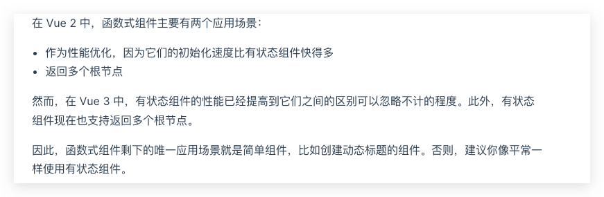

# 高阶组件

- Created: November 30, 2021 10:25 PM
- Update: March 20, 2022 10:28 PM
- 分类: Vue
- 可参考文章: 
    - https://github.com/vuejs/vue/issues/6201
    - https://github.com/jackmellis/vue-hoc
    - https://zhuanlan.zhihu.com/p/24776678
    - https://zhuanlan.zhihu.com/p/37920151
- 学习状态: Yes
- 学习进度: 复习中
- 模块: 开发框架

# 什么是高阶组件？

Higher Order Component，高阶组件，HOC

可以理解等同于高阶函数，即传入一个函数，返回一个新函数

所以就是

接收一个组件作为参数，返回一个新组件

我更愿意称它为跳板组件，我用它比较多的用途就是写 UI  组件库时，比如某个组件某个区域，允许传入任意组件渲染，而不用插槽的方式，就会用 hoc 的方式作为中间跳板，外部传入渲染任意组件的对象，然后经过 hoc render（渲染函数），就可以渲染该组件

```jsx
/**
 * 高阶组件，传递参数生成另一个组件
 */
function hoc(h, options) {
	const { name, on, attrs, props, scopedSlots } = options;
	return h(name, {
		on: on, // 监听方法
		attrs: attrs, // 未被声明的属性
		props: props, // 高阶组件接收到的props属性
		scopedSlots: scopedSlots // 插槽
	});
}

export default hoc;
```

[渲染函数 & JSX - Vue.js](https://cn.vuejs.org/v2/guide/render-function.html)

- 深入渲染函数对象
    
    ```jsx
    {
      // 与 `v-bind:class` 的 API 相同，
      // 接受一个字符串、对象或字符串和对象组成的数组
      'class': {
        foo: true,
        bar: false
      },
      // 与 `v-bind:style` 的 API 相同，
      // 接受一个字符串、对象，或对象组成的数组
      style: {
        color: 'red',
        fontSize: '14px'
      },
      // 普通的 HTML attribute
      attrs: {
        id: 'foo'
      },
      // 组件 prop
      props: {
        myProp: 'bar'
      },
      // DOM property
      domProps: {
        innerHTML: 'baz'
      },
      // 事件监听器在 `on` 内，
      // 但不再支持如 `v-on:keyup.enter` 这样的修饰器。
      // 需要在处理函数中手动检查 keyCode。
      on: {
        click: this.clickHandler
      },
      // 仅用于组件，用于监听原生事件，而不是组件内部使用
      // `vm.$emit` 触发的事件。
      nativeOn: {
        click: this.nativeClickHandler
      },
      // 自定义指令。注意，你无法对 `binding` 中的 `oldValue`
      // 赋值，因为 Vue 已经自动为你进行了同步。
      directives: [
        {
          name: 'my-custom-directive',
          value: '2',
          expression: '1 + 1',
          arg: 'foo',
          modifiers: {
            bar: true
          }
        }
      ],
      // 作用域插槽的格式为
      // { name: props => VNode | Array<VNode> }
      scopedSlots: {
        default: props => createElement('span', props.text)
      },
      // 如果组件是其它组件的子组件，需为插槽指定名称
      slot: 'name-of-slot',
      // 其它特殊顶层 property
      key: 'myKey',
      ref: 'myRef',
      // 如果你在渲染函数中给多个元素都应用了相同的 ref 名，
      // 那么 `$refs.myRef` 会变成一个数组。
      refInFor: true
    }
    ```
    

## 渲染函数？

vue 中实现高阶组件就需要用到渲染函数 render

## 函数式组件？

在vue@2中，可以将组件标记为  functional: true，只接收一些 props，内部没有状态变化，即无状态变化的组件，就是函数式组件（也没有实例，即上下文）

一个函数式组件就像这样

```jsx
Vue.component('my-component', {
  functional: true,
  // Props 是可选的
  props: {
    // ...
  },
  // 为了弥补缺少的实例
  // 提供第二个参数作为上下文
  render: function (createElement, context) {
    // ...
  }
})
```

> 感觉有点类似与 Flutter 的 StatelessWidget，内部不需要关注状态的变化，只用关心传入的值和渲染的界面，其实在 Fultter 开发时，我大部分还是直接使用的 StagefulWidget 组件
> 

在 vue@3 中有如下描述，函数式组件可以不再使用，因为带来的性能提升不再明显，建议都是用有状态组件



[函数式组件 | Vue.js](https://v3.cn.vuejs.org/guide/migration/functional-components.html#%E6%A6%82%E8%A7%88)

# JSX

相较于渲染函数的更优雅易懂的写法，更接近与模板语法，不过需要借助 babel 插件

[JSX](https://facebook.github.io/jsx/)

[GitHub - vuejs/jsx-vue2: monorepo for Babel / Vue JSX related packages](https://github.com/vuejs/jsx-vue2)

## 普通模板的写法

```jsx
<anchored-heading :level="1">
  <span>Hello</span> world!
</anchored-heading>
```

## 渲染函数的写法

```jsx
createElement(
  'anchored-heading', {
    props: {
      level: 1
    }
  }, [
    createElement('span', 'Hello'),
    ' world!'
  ]
)
```

## JSX 的写法

```jsx
import AnchoredHeading from './AnchoredHeading.vue'

new Vue({
  el: '#demo',
  render: function (h) {
    return (
      <AnchoredHeading level={1}>
        <span>Hello</span> world!
      </AnchoredHeading>
    )
  }
})
```