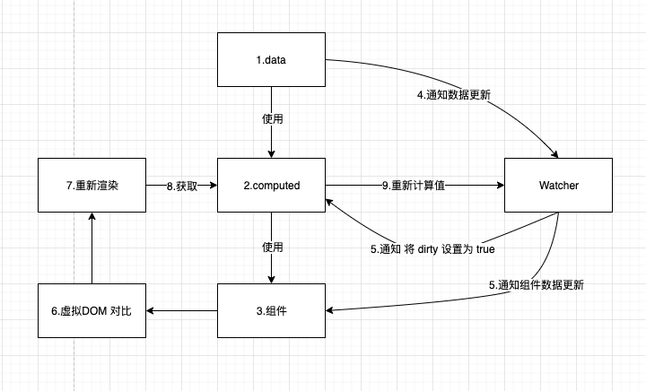

# computed 和 watch

- Created: November 30, 2021 10:26 PM
- Update: March 20, 2022 10:28 PM
- 分类: Vue
- 学习状态: Yes
- 学习进度: 复习中
- 模块: 开发框架

# computed 的实现原理



- 源码实现
    
    ```jsx
    // 源码位置 src/core/instance/state.js
    
    // export function initState (vm: Component) {
      vm._watchers = []
      const opts = vm.$options
      if (opts.props) initProps(vm, opts.props)
      if (opts.methods) initMethods(vm, opts.methods)
      if (opts.data) {
        initData(vm)
      } else {
        observe(vm._data = {}, true /* asRootData */)
      }
      if (opts.computed) initComputed(vm, opts.computed)
      if (opts.watch && opts.watch !== nativeWatch) { // 检查是否是原生浏览器watch方法，因为firefox Object.prototype上有一个watch方法
        initWatch(vm, opts.watch)
      }
    }
    
    //
    function initComputed (vm: Component, computed: Object) {
      const watchers = vm._computedWatchers = Object.create(null)
      // computed properties are just getters during SSR
      const isSSR = isServerRendering()
    
      for (const key in computed) {
        const userDef = computed[key]
        const getter = typeof userDef === 'function' ? userDef : userDef.get
        if (process.env.NODE_ENV !== 'production' && getter == null) {
          warn(
            `Getter is missing for computed property "${key}".`,
            vm
          )
        }
    		
    
        if (!isSSR) {
          // create internal watcher for the computed property.
          watchers[key] = new Watcher(
            vm,
            getter || noop,
            noop,
            computedWatcherOptions
          )
        }
    
        // component-defined computed properties are already defined on the
        // component prototype. We only need to define computed properties defined
        // at instantiation here.
        if (!(key in vm)) {
          defineComputed(vm, key, userDef)
        } else if (process.env.NODE_ENV !== 'production') {
          if (key in vm.$data) {
            warn(`The computed property "${key}" is already defined in data.`, vm)
          } else if (vm.$options.props && key in vm.$options.props) {
            warn(`The computed property "${key}" is already defined as a prop.`, vm)
          }
        }
      }
    }
    
    export function defineComputed (
      target: any,
      key: string,
      userDef: Object | Function
    ) {
      const shouldCache = !isServerRendering() // 是否缓存
    
      if (typeof userDef === 'function') {
        sharedPropertyDefinition.get = shouldCache
          ? createComputedGetter(key)
          : userDef
        sharedPropertyDefinition.set = noop
      } else {
        sharedPropertyDefinition.get = userDef.get
          ? shouldCache && userDef.cache !== false
            ? createComputedGetter(key)
            : userDef.get
          : noop
        sharedPropertyDefinition.set = userDef.set
          ? userDef.set
          : noop
      }
      if (process.env.NODE_ENV !== 'production' &&
          sharedPropertyDefinition.set === noop) {
        sharedPropertyDefinition.set = function () {
          warn(
            `Computed property "${key}" was assigned to but it has no setter.`,
            this
          )
        }
      }
      Object.defineProperty(target, key, sharedPropertyDefinition)
    }
    
    // 如果开启缓存 computed 计算结果，则调用该方法，会检查 watcher.dirty, 用于检查是否需要更新
    function createComputedGetter (key) {
      return function computedGetter () {
        const watcher = this._computedWatchers && this._computedWatchers[key]
        if (watcher) {
          // 如果  dirty 为 ture 时，重新计算值，否则直接返回值
          if (watcher.dirty) {
            watcher.evaluate()
          }
          if (Dep.target) {
            watcher.depend()
          }
          return watcher.value
        }
      }
    }
    ```
    
    ```jsx
    // 源码位置 src/core/observer/watcher.js
    
    /**
       * Evaluate the value of the watcher.
       * This only gets called for lazy watchers.
       */
      evaluate () {
        this.value = this.get() // 获取数据，对于 compouted 来说就会重新计算值
        this.dirty = false // 然后置为 false
      }
    
    /**
       * Subscriber interface.
       * Will be called when a dependency changes.
       */
      update () {
        /* istanbul ignore else */
        if (this.lazy) { // 比如数据更新时，Watcher 通知 computed，触发更新，将 dirty 置为 true，在下次调用 getter 时，会触发更新
          this.dirty = true
        } else if (this.sync) {
          this.run()
        } else {
          queueWatcher(this)
        }
      }
    ```
    

监听数据变化，重新计算值

特点就是：

- 计算结果缓存，数据改变时，会在下次数据读取时重新计算
- 如果是一个函数，会监测函数内使用到的所有响应式数据
- 数据更新后，watcher 通知 computed 依赖重新计算值，并将 dirty 设置为 true，等待下次使用

# watch 的实现原理

```jsx
// 源码位置 src/core/instance/state.js
export function initState (vm: Component) {
  vm._watchers = []
  const opts = vm.$options
  if (opts.props) initProps(vm, opts.props)
  if (opts.methods) initMethods(vm, opts.methods)
  if (opts.data) {
    initData(vm)
  } else {
    observe(vm._data = {}, true /* asRootData */)
  }
  if (opts.computed) initComputed(vm, opts.computed)
  if (opts.watch && opts.watch !== nativeWatch) { // 检查是否是原生浏览器watch方法，因为firefox Object.prototype上有一个watch方法
    initWatch(vm, opts.watch)
  }
}

function initWatch (vm: Component, watch: Object) {
  // key 可以是 object 或 方法名
  for (const key in watch) {
    const handler = watch[key]
    // 如果是集合，则遍历将每一项都创建 watcher
    if (Array.isArray(handler)) {
      for (let i = 0; i < handler.length; i++) {
        createWatcher(vm, key, handler[i])
      }
    } else {
      createWatcher(vm, key, handler)
    }
  }
}

/**
  处理下面几种情况：
  watch: {
    data1: function (newV, oldV) {
      // TODO
    },
    data2(newV, oldV) {
        // TODO
    },
    data3: {
        handler: function (newV, oldV) {
            // TODO
        },
        { deep: true, immediate: true }
    }
  },
 */
function createWatcher (
  vm: Component,
  keyOrFn: string | Function,
  handler: any,
  options?: Object
) {
  // 如果是对象的写法
  if (isPlainObject(handler)) {
    options = handler
    handler = handler.handler
  }
  if (typeof handler === 'string') {
    handler = vm[handler]
  }
  return vm.$watch(keyOrFn, handler, options)
}
```

```jsx
Vue.prototype.$watch = function (
    expOrFn: string | Function,
    cb: any,
    options?: Object
  ): Function {
    const vm: Component = this
    if (isPlainObject(cb)) {
      return createWatcher(vm, expOrFn, cb, options)
    }
    options = options || {}
    options.user = true

    // 实例化 Watcher, expOrFn 可以是字符串或方法，如果是字符串则作为对象属性，则监听该属性的变化，如果是方法，则监听该方法内所有属性的变化
    const watcher = new Watcher(vm, expOrFn, cb, options)

    // 如果有 immediate 属性，立即执行并返回值
    if (options.immediate) {
      cb.call(vm, watcher.value)
    }

    // 返回一个取消监听的函数，本质上是将 Watcher 从依赖列表中删除
    return function unwatchFn () {
      watcher.teardown()
    }
  }
```

监听数据变化，根据数据变化处理相应逻辑（不仅仅是重新计算值）

特点

- 如果是方法，同样可以监听内部多个响应式数据
- 支持传入options，deep, immediate
- 返回一个unWatch，取消监听
- 数据更新后，由 watcher 通知 watch 依赖，由 watch 自行处理后续逻辑，适用场景更广，而compute后续逻辑固定为计算值