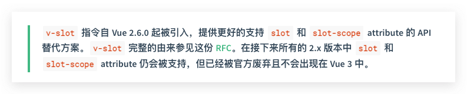

# 插槽 slot

- Created: November 30, 2021 10:26 PM
- Update: March 20, 2022 10:28 PM
- 分类: Vue
- 学习状态: Yes
- 学习进度: 复习中
- 模块: 开发框架

# 插槽如何使用？

# 插槽的实现原理

添加标志，根据标志生成代码字符串renderSlot执行，用父组件的上下文生成vnodes，子节点渲染时，根据key插入对应的slot

## 模板解析阶段

parser → processSlot 解析template slot 字符串，会设置 el.slotScope, el.slotTarget

- 实现源码
    
    ```jsx
    // 源码位置 src/compiler/parser/index.js
    
    function processSlot (el) {
    
      // 如果标签为 slot, 即子组件定义的 <slot></slot> 插槽
      if (el.tag === 'slot') {
        el.slotName = getBindingAttr(el, 'name')
        if (process.env.NODE_ENV !== 'production' && el.key) {
          warn(
            `\`key\` does not work on <slot> because slots are abstract outlets ` +
            `and can possibly expand into multiple elements. ` +
            `Use the key on a wrapping element instead.`
          )
        }
      } else {
        let slotScope // 编译作用域
    
        // 如果是 template，即父组件使用子组件定义的具名插槽
        // <template v-slot="name"></template>
        if (el.tag === 'template') {
          slotScope = getAndRemoveAttr(el, 'scope')
          /* istanbul ignore if */
          if (process.env.NODE_ENV !== 'production' && slotScope) {
            warn(
              `the "scope" attribute for scoped slots have been deprecated and ` +
              `replaced by "slot-scope" since 2.5. The new "slot-scope" attribute ` +
              `can also be used on plain elements in addition to <template> to ` +
              `denote scoped slots.`,
              true
            )
          }
          el.slotScope = slotScope || getAndRemoveAttr(el, 'slot-scope') // vue@2.6 版本已经废弃改属性，不过在 vue@2 中还是可用，vue@3 中不可用
        } else if ((slotScope = getAndRemoveAttr(el, 'slot-scope'))) {
          el.slotScope = slotScope
        }
        const slotTarget = getBindingAttr(el, 'slot') // 获取具名名称,例如上面例子的 name，如果没有，则为 default
        if (slotTarget) {
          el.slotTarget = slotTarget === '""' ? '"default"' : slotTarget // 设置 slotTarget，后面生成代码字符串会用到
          // preserve slot as an attribute for native shadow DOM compat
          // only for non-scoped slots.
          if (!el.slotScope) {
            addAttr(el, 'slot', slotTarget)
          }
        }
      }
    }
    ```
    

## 代码字符串生成阶段

父组件代码生成

```jsx
// 源码位置 src/compiler/codegen/index.js

// slot target
  // only for non-scoped slots
  if (el.slotTarget && !el.slotScope) {
    data += `slot:${el.slotTarget},`
  }
  // scoped slots
  if (el.scopedSlots) {
    data += `${genScopedSlots(el.scopedSlots, state)},`
  }
```

子组件代码生成

```jsx
// 源码位置 src/compiler/codegen/index.js

// if el.tag === 'slot'

function genSlot (el: ASTElement, state: CodegenState): string {
  const slotName = el.slotName || '"default"'
  const children = genChildren(el, state)
  let res = `_t(${slotName}${children ? `,${children}` : ''}`
  const attrs = el.attrs && `{${el.attrs.map(a => `${camelize(a.name)}:${a.value}`).join(',')}}`
  const bind = el.attrsMap['v-bind']
  if ((attrs || bind) && !children) {
    res += `,null`
  }
  if (attrs) {
    res += `,${attrs}`
  }
  if (bind) {
    res += `${attrs ? '' : ',null'},${bind}`
  }
  return res + ')'
}

//实际生成的代码主要是下面这种
/*
const slotName = el.slotName || '"default"'
const children = genChildren(el, state)
let res = `_t(${slotName}${children ? `,${children}` : ''}`
*/

// 其中 _t 是 renderSlot 方法，位于 src/core/instance/render-helpers/render-slot.js
```

编译时 renderSlot 将生成到的 slots vnode(options._renderChildren)，然后在子组件 initRender 时根据 Key获取，最后赋值给 vm.$slots 渲染

```jsx
export function initRender (vm: Component) {
  vm._vnode = null // the root of the child tree
  const options = vm.$options
  const parentVnode = vm.$vnode = options._parentVnode // the placeholder node in parent tree
  const renderContext = parentVnode && parentVnode.context
  // options._renderChildren 父 vnode 的 children
  vm.$slots = resolveSlots(options._renderChildren, renderContext) // 获取父组件上下文
  vm.$scopedSlots = emptyObject

	// TODO
}
```

- resolveSlot 实现源码
    
    ```jsx
    // 源码位置 src/core/instance/render-helpers/resolve-slots.js
    
    /* @flow */
    
    /**
     * Runtime helper for resolving raw children VNodes into a slot object.
     */
    export function resolveSlots (
      children: ?Array<VNode>,
      context: ?Component // 父组件实例
    ): { [key: string]: Array<VNode> } {
      const slots = {}
      if (!children) {
        return slots
      }
      const defaultSlot = []
      for (let i = 0, l = children.length; i < l; i++) {
        const child = children[i]
        const data = child.data
        // remove slot attribute if the node is resolved as a Vue slot node
        if (data && data.attrs && data.attrs.slot) {
          delete data.attrs.slot
        }
        // named slots should only be respected if the vnode was rendered in the
        // same context.
        if ((child.context === context || child.functionalContext === context) &&
          data && data.slot != null
        ) {
          const name = child.data.slot
          // 以插槽具名key 存储插槽节点，允许重名，所以有下面这段逻辑
          const slot = (slots[name] || (slots[name] = []))
    
          // 然后将插槽 vnode 放入插槽数组中
          if (child.tag === 'template') {
            slot.push.apply(slot, child.children) // 所有的子节点都 push 进去
          } else {
            slot.push(child)
          }
        } else { // 如果不是具名，则放入到默认插槽中
          defaultSlot.push(child)
        }
      }
      // ignore whitespace
      if (!defaultSlot.every(isWhitespace)) {
        slots.default = defaultSlot
      }
      return slots
    }
    
    function isWhitespace (node: VNode): boolean {
      return node.isComment || node.text === ' '
    }
    
    export function resolveScopedSlots (
      fns: ScopedSlotsData, // see flow/vnode
      res?: Object
    ): { [key: string]: Function } {
      res = res || {}
      for (let i = 0; i < fns.length; i++) {
        if (Array.isArray(fns[i])) {
          resolveScopedSlots(fns[i], res)
        } else {
          res[fns[i].key] = fns[i].fn
        }
      }
      return res
    }
    ```
    

核心原理就是：父组件实例的上下文，生成插槽 children vnode，然后子组件可以根据 key 获取并添加到子组件实例，即 vm.$slots 上，最后再渲染节点

## 作用域插槽

核心原理就是：将插槽涉及到的数据收集起来，在 renderSlot 时调用 scopedSlotFn(props)，这个方法是在模板编译时作用域插槽生成的，可以传入参数渲染节点



### 为什么要废弃作用域插槽呢？

因为无法准确清晰的知道（追踪到）插槽使用的数据来自那里（那个组件提供的这个变量数据），具体讨论可以看 RFC

[rfcs/0001-new-slot-syntax.md at master · vuejs/rfcs](https://github.com/vuejs/rfcs/blob/master/active-rfcs/0001-new-slot-syntax.md)

## vue@2.6 引入的 v-slot

基于上面，所以诞生了 v-slot，不区分作用域插槽，可以清晰的传递参数到插槽内，例如

```jsx
<current-user>
  <template v-slot:default="slotProps">
    {{ slotProps.user.firstName }}
  </template>
</current-user>
```