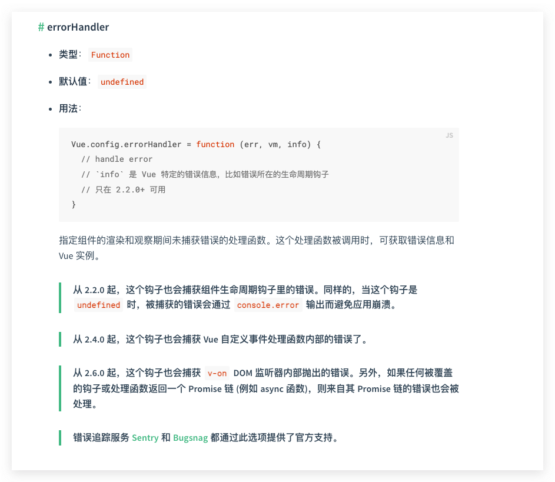

# 错误捕获

- Created: December 2, 2021 10:46 PM
- Update: March 20, 2022 10:28 PM
- 分类: Vue
- 可参考文章: https://weread.qq.com/web/reader/f8632810723f0231f86d9aak37632cd021737693cfc7149
- 学习状态: Yes
- 学习进度: 复习中
- 模块: 开发框架

[API - Vue.js](https://cn.vuejs.org/v2/api/#errorHandler)



核心原理：自底向上的查找，触发 errorCaptured 勾子函数，直到查找到根节点或者钩子函数返回false时，停止向上传播错误（也就是说该错误已被搞定，应该忽略）

以下地方有在调用 handleError，捕获错误

- src/core/instance/events.js
- src/core/instance/lifecycle.js
- src/core/instance/render.js
- src/core/instance/state.js
- src/core/observer/watcher.js
- src/core/util/next-tick.js
- src/core/vdom/modules/directives.js

## errorCaptured

errorCaptured钩子函数的作用是捕获来自子孙组件的错误，此钩子函数会收到三个参数：错误对象、发生错误的组件实例以及一个包含错误来源信息的字符串。然后此钩子函数可以返回false，阻止该错误继续向上传播

其传播规则如下

- 默认情况下，如果全局的config.errorHandler被定义，那么所有的错误都会发送给它，这样这些错误可以在单个位置报告给分析服务。
- 如果一个组件继承的链路或其父级从属链路中存在多个errorCaptured钩子，则它们将会被相同的错误逐个唤起。
- 如果errorCaptured钩子函数自身抛出了一个错误，则这个新错误和原本被捕获的错误都会发送给全局的config.errorHandler。
- 一个errorCaptured钩子函数能够返回false来阻止错误继续向上传播。这本质上是说“这个错误已经被搞定，应该被忽略”。它会阻止其他被这个错误唤起的errorCaptured钩子函数和全局的config.errorHandler。了解了errorCaptured钩子函数的作用后，我们将详细讨论它是如何被触发的。

### 是如何触发的？

事实上，errorCaptured钩子函数与Vue.js的错误处理有着千丝万缕的关系。Vue.js会捕获所有用户代码抛出的错误，然后会使用一个名叫handleError的函数来处理这些错误

用户编写的所有函数都是Vue.js调用的，例如用户在代码中注册的事件、生命周期钩子、渲染函数、函数类型的data属性、vm.$watch的第一个参数（函数类型）、nextTick和指令等

而Vue.js在调用这些函数时，会使用try...catch语句来捕获有可能发生的错误。当错误发生并且被try...catch语句捕获后，Vue.js会使用handleError函数来处理错误，该函数会依次触发父组件链路上的每一个父组件中定义的errorCaptured钩子函数。如果全局的config.errorHandler被定义，那么所有的错误也会同时发送给config.errorHandler。

也就是说，错误的传播规则是在handleError函数中实现的

- 实现源码
    
    ```jsx
    // 源码位置 src/core/util/error.js
    
    /* @flow */
    
    import config from '../config'
    import { warn } from './debug'
    import { inBrowser } from './env'
    
    /**
     * 自底向上查找，直到根节点
     * 如果一个组件继承的链路或其父级从属链路中存在多个errorCaptured钩子函数，则它们将会被相同的错误逐个唤起
     */
    export function handleError (err: Error, vm: any, info: string) {
      if (vm) {
        let cur = vm
        while ((cur = cur.$parent)) {
          // 当这个组件的父级组件定义了一个或多个 errorCaptured 钩子函数，则调用这些钩子函数
          const hooks = cur.$options.errorCaptured
          if (hooks) {
            for (let i = 0; i < hooks.length; i++) {
              try {
                // 如果执行函数结果返回 false，则不再继续向上传递
                const capture = hooks[i].call(cur, err, vm, info) === false
                if (capture) return
              } catch (e) {
                globalHandleError(e, cur, 'errorCaptured hook')
              }
            }
          }
        }
      }
      globalHandleError(err, vm, info)
    }
    
    // 收集所有的错误处理函数
    function globalHandleError (err, vm, info) {
      if (config.errorHandler) {
        try {
          return config.errorHandler.call(null, err, vm, info)
        } catch (e) {
          logError(e, null, 'config.errorHandler')
        }
      }
      // 不管什么情况，都将错误信息打印到控制台
      logError(err, vm, info)
    }
    
    function logError (err, vm, info) {
      if (process.env.NODE_ENV !== 'production') {
        warn(`Error in ${info}: "${err.toString()}"`, vm)
      }
      /* istanbul ignore else */
      if (inBrowser && typeof console !== 'undefined') {
        console.error(err)
      } else {
        throw err
      }
    }
    ```
    

# 面试可能问:

- **[Day104:项目中如何进行异常捕获](https://github.com/lgwebdream/FE-Interview/issues/917)**